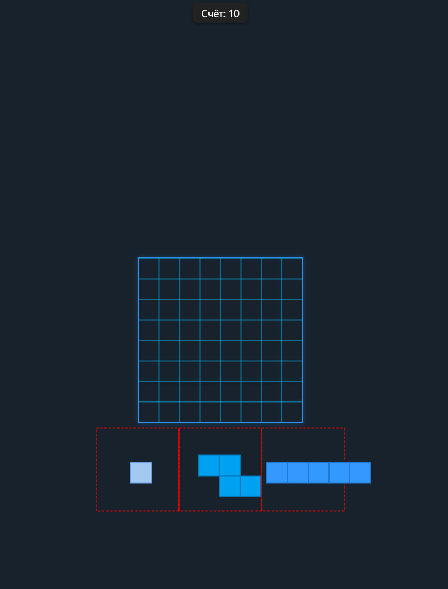
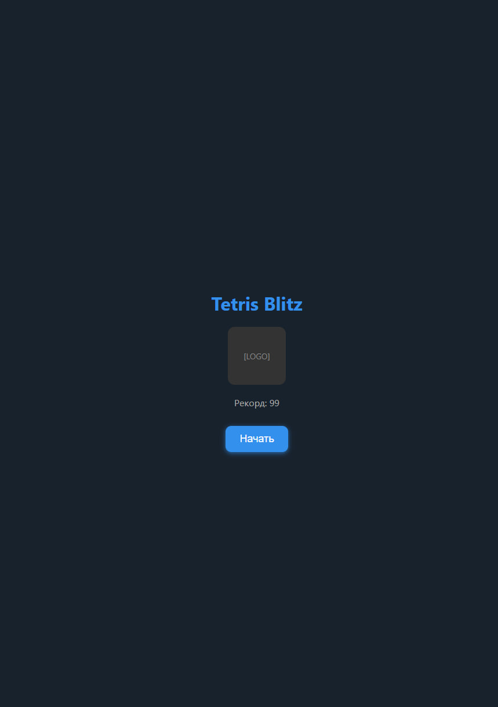
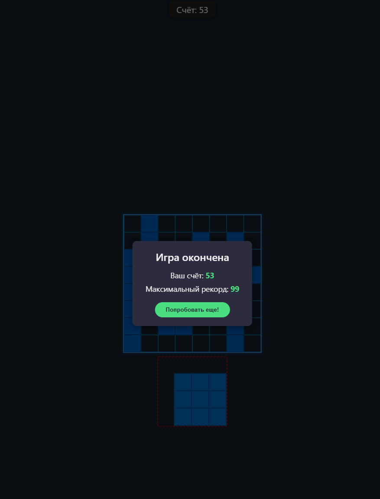

# Telegram Tetris Blitz

---

## English 🇺🇸

**Telegram Tetris Blitz** (Alpha v0.1.0) is a minimalist and fast Tetris game designed for Telegram WebApp with enhanced gameplay and automated deployment.

### Features

- Modern HTML5 Canvas interface  
- Touch-friendly controls with dynamic drag sensitivity  
- Automatic figure spawning without manual buttons  
- Multiple new figure types with smarter generation logic  
- Scoring system with a live points counter  
- Game over detection and a welcome screen  

### Screenshots

| Welcome Screen                     | Game Screen                        | Game Over Screen                 |
| -------------------------------- | -------------------------------- | ------------------------------- |
|  |  |  |

### Deployment

- Continuous Integration and Deployment (CI/CD) pipeline set up for automatic updates to the server on push to `main` branch

### Current status

Alpha v0.1.0 — active development stage, playable but may still contain bugs.

---

## Русский 🇷🇺

**Telegram Tetris Blitz** (Alpha v0.1.0) — минималистичная и быстрая игра Тетрис для Telegram WebApp с улучшенным игровым процессом и автоматическим деплоем.

### Особенности

- Современный интерфейс на HTML5 Canvas  
- Управление, удобное для сенсорных устройств с динамической чувствительностью перетаскивания  
- Автоматический спавн фигур без кнопок  
- Новые типы фигур с более умной генерацией  
- Счетчик очков в реальном времени  
- Обнаружение окончания игры и приветственный экран  

### Скриншоты

| Экран приветствия                | Игровой процесс                  | Экран окончания игры             |
| ------------------------------- | ------------------------------- | ------------------------------- |
|  |  |  |

### Деплоймент

- Настроенный CI/CD для автоматического обновления на сервере при пуше в ветку `main`

### Текущий статус

Alpha v0.1.0 — активная стадия разработки, игра работоспособна, но возможны баги.
