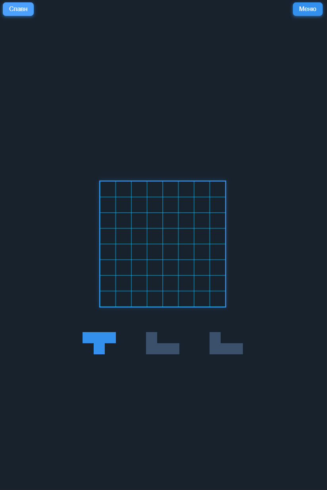

# Telegram Tetris Blitz

---

## English 🇺🇸

**Telegram Tetris Blitz** (pre-Alpha v0.0.3) is a minimalist and fast Tetris game designed for Telegram WebApp.

### Features

- Modern HTML5 Canvas interface  
- Touch-friendly controls with dynamic drag sensitivity  
- Fast and intuitive gameplay  
- Compatible with Telegram WebApp environment  

### Current status

Pre-Alpha v0.0.3 — early development stage, bugs and API changes possible.

---

## Русский 🇷🇺

**Telegram Tetris Blitz** (pre-Alpha v0.0.3) — минималистичная и быстрая игра Тетрис, созданная для Telegram WebApp.

### Особенности

- Современный интерфейс на HTML5 Canvas  
- Управление, удобное для сенсорных устройств с динамической чувствительностью перетаскивания  
- Быстрый и интуитивно понятный игровой процесс  
- Совместимость с Telegram WebApp  

### Текущий статус

Pre-Alpha v0.0.3 — ранняя стадия разработки, возможны баги и изменения API.